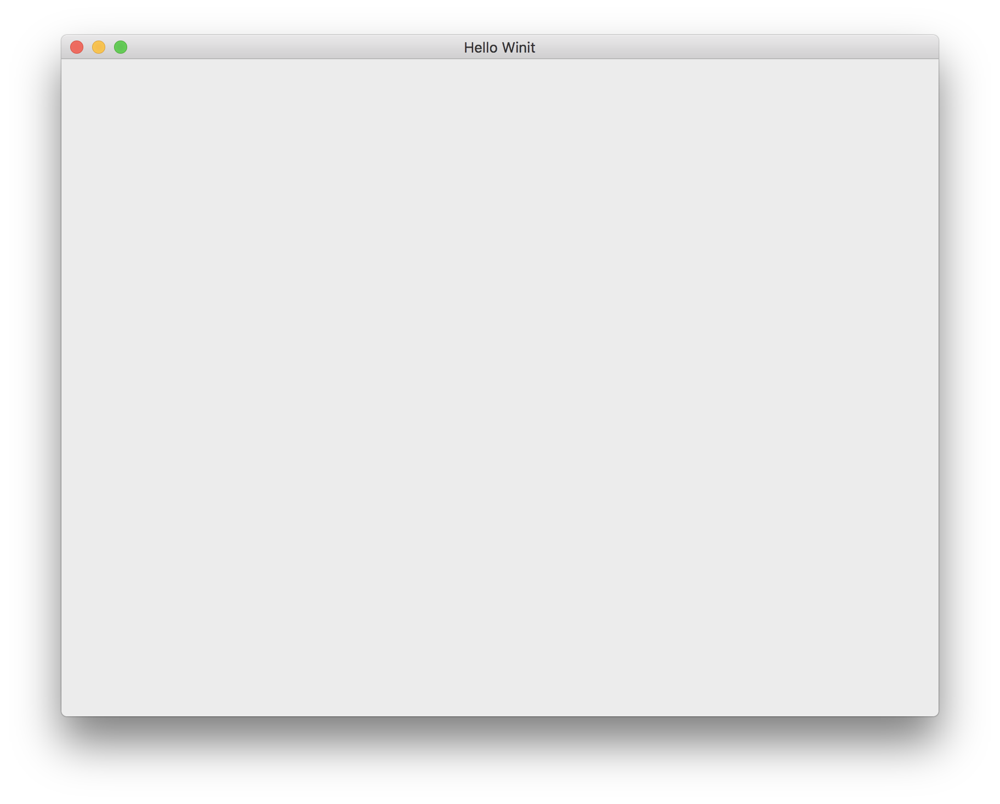

# Opening A Window

Before we can draw anything, we need a place to draw it. That means we need to
open a window.

## Initializing A Window

To open a window in Rust, you want to use the [winit](https://docs.rs/winit/)
crate to get the best cross-platform coverage available. At the time of writing,
the latest version is 0.18. Set up a project for this tutorial however you like
and just add `winit` to your `Cargo.toml`:

```toml
[dependencies]
winit = "0.18"
```

The `winit` crate is what you'd call "mostly stable". There are small breaking changes
with new versions, but it's usually plain enough to see what the new types or methods
that you need to move to are.

The [crate documentation](https://docs.rs/winit/0.18.0/winit/#building-a-window)
goes over the basic steps of building a window:

```rust
let events_loop = EventsLoop::new();
let window = WindowBuilder::new()
  .with_title("Example")
  .build(&events_loop)
  .expect("Could not create a window!");
```

Of course, the
[WindowBuilder](https://docs.rs/winit/0.18.0/winit/struct.WindowBuilder.html)
type has many other methods you might want to use, so be sure to check all 
that out.

## Responding To Events

Once the window is open the user will try to interact with the window. They'll
move the mouse, type keys, click the `x` in the corner to close it, things like
that. You handle all of this with 
[EventsLoop](https://docs.rs/winit/0.18.0/winit/struct.EventsLoop.html).
You can call
[run_forever](https://docs.rs/winit/0.18.0/winit/struct.EventsLoop.html#method.run_forever)
with a callback, or 
[poll_events](https://docs.rs/winit/0.18.0/winit/struct.EventsLoop.html#method.poll_events)
with a callback. In both cases, your callback gets an
[Event](https://docs.rs/winit/0.18.0/winit/enum.Event.html), which is an enum.
Naturally we have to match on that and find the cases we care about. We can discard the 
other types. You'll actually get a whole lot of events through `winit`,
so it's definitely good to ignore most of them if you only care about one or two
event types.

```rust
let mut running = true;
while running {
  events_loop.poll_events(|event| match event {
    Event::WindowEvent {
      event: WindowEvent::CloseRequested,
      ..
    } => running = false,
    _ => (),
  });
}
```

## Pack It Together

We'll have a lot of things floating around as we go along, so we'll want to pack
things together when we can. Winit doesn't care what graphical libs you're using
to draw within the frame, so we can keep just the windowing stuff in its own
struct, apart from any gfx-hal things.

```rust
#[derive(Debug)]
pub struct WinitState {
  pub events_loop: EventsLoop,
  pub window: Window,
}
```

Of course, we want to streamline those building steps:

```rust
impl WinitState {
  /// Constructs a new `EventsLoop` and `Window` pair.
  ///
  /// The specified title and size are used, other elements are default.
  /// ## Failure
  /// It's possible for the window creation to fail. This is unlikely.
  pub fn new<T: Into<String>>(title: T, size: LogicalSize) -> Result<Self, CreationError> {
    let events_loop = EventsLoop::new();
    let output = WindowBuilder::new()
      .with_title(title)
      .with_dimensions(size)
      .build(&events_loop);
    output.map(|window| Self {
      events_loop,
      window,
    })
  }
}
```

And we probably want to go one step farther for our examples and just give a
`Default` impl that calls `new` with some default values and then panics if
there's a `CreationError`.

```rust
pub const WINDOW_NAME: &str = "Hello Winit";

impl Default for WinitState {
  /// Makes an 800x600 window with the `WINDOW_NAME` value as the title.
  /// ## Panics
  /// If a `CreationError` occurs.
  fn default() -> Self {
    Self::new(
      WINDOW_NAME,
      LogicalSize {
        width: 800.0,
        height: 600.0,
      },
    )
    .expect("Could not create a window!")
  }
}
```

## Running The Program

So far we only have a very tiny main function to look at:

```rust
fn main() {
  let mut winit_state = WinitState::default();
  let mut running = true;
  while running {
    winit_state.events_loop.poll_events(|event| match event {
      Event::WindowEvent {
        event: WindowEvent::CloseRequested,
        ..
      } => running = false,
      _ => (),
    });
  }
}
```

If you run this you get an all white window. Actually, without anything being
drawn to the window, it might instead show all black, or even just garbage pixel
data. It depends on your windowing system.

Also, normally an application would use "Vertical Synchronization" (Vsync) to
slow down the main loop. Without any drawing code we can't use vsync, so the
loop will run as fast as possible and use 100% of the core it's on.

Both things are not good, but this is just a stepping stone and we learn
to draw stuff in the next lesson, so it's fine.



All of the code discussed here is available within the
[hello_winit](https://github.com/gfx-rs/learn-gfx-hal/blob/master/examples/hello_winit.rs)
example.
